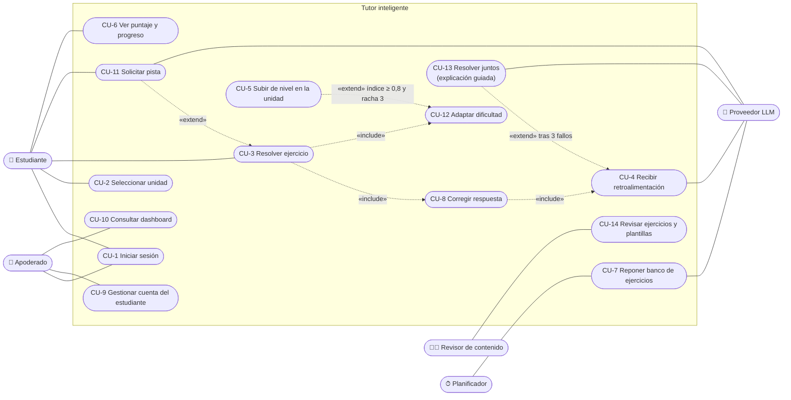

# Diagrama de Casos de Uso (Fase III, tarea 37)

**Proyecto:** Tutor inteligente basado en IA para el aprendizaje de matemáticas — eje de Números, 4°–6° básico.
**Documento:** Diagrama de casos de uso formal y especificación breve de cada caso. Reemplaza el diagrama preliminar del anteproyecto (CU-1 a CU-8) según lo exigido en `arquitectura.md` §7: actor Apoderado (CU-9, CU-10), casos de pista y adaptación (CU-11, CU-12), corrección programática (el LLM ya no evalúa respuestas), generación de ejercicios fuera del flujo de uso y LLM como actor secundario de infraestructura.

---

## 1. Actores

| Actor | Tipo | Descripción |
|---|---|---|
| **Estudiante** | primario, humano | Niño/a de 4°–6° básico. Entra con perfil + PIN, practica, pide ayuda y ve su progreso gamificado. |
| **Apoderado** | primario, humano | Titular de la cuenta. Crea el perfil del estudiante, define el curso y el PIN, y consulta el dashboard. |
| **Revisor de contenido** | primario, humano | Integrante del equipo que ejecuta la compuerta editorial (capa 4 del pipeline, `modelo_dominio.md` §8) y aprueba las plantillas paramétricas. No es un rol de la app (el administrador sigue fuera de alcance): opera con una herramienta de línea de comandos del backend (§4). |
| **Planificador** | primario, sistema | Proceso periódico (APScheduler) que detecta celdas unidad×nivel con stock bajo y dispara la reposición (F5). |
| **Proveedor LLM** (GPT-5.4 nano) | secundario, sistema | API externa, siempre detrás del Adaptador. Genera ejercicios verbales, retroalimentación, pistas reformuladas y la narración guiada. **No corrige respuestas.** |

## 2. Diagrama

Mermaid no tiene una notación nativa de casos de uso; se representa con un diagrama de flujo: los actores a los costados, los casos como óvalos dentro del límite del sistema y las relaciones `«include»` / `«extend»` rotuladas.

## 3. Especificación de los casos de uso

| CU | Nombre | Actor | Resumen del flujo principal | Requisitos |
|---|---|---|---|---|
| CU-1 | Iniciar sesión | Estudiante, Apoderado | La pantalla de acceso separa las dos entradas. Apoderado: correo + contraseña. Estudiante: elige su perfil en el dispositivo e ingresa el PIN. El servidor emite un JWT con el rol. | RF-A2, RF-A3, RNF-S1 |
| CU-2 | Seleccionar unidad | Estudiante | Ve las unidades de su curso y de los anteriores con su nivel en estrellas y la **unidad sugerida** destacada; elige libremente. | RF-D1, RF-E5; `modelo_estudiante.md` §5 |
| CU-3 | Resolver ejercicio | Estudiante | El sistema sirve un ejercicio `activo` no visto de la celda unidad×nivel actual (sin LLM). El estudiante responde; se incluyen la corrección (CU-8) y la adaptación (CU-12). Puede pasar a "otro ejercicio" sin penalización. | RF-D7, RF-E1, RNF-R2 |
| CU-4 | Recibir retroalimentación | Estudiante (vía CU-8) | Correcta: refuerzo desde plantillas locales + puntos, sin LLM. Incorrecta: el LLM explica la causa probable sin revelar la respuesta; la salida pasa el filtro de no revelación. Incluye la acción "no entiendo" (re-explicación). Sin LLM disponible: plantilla local (F6). | RF-P1, RF-P2, RF-P4–P6, RNF-P2, RNF-R3 |
| CU-5 | Subir de nivel en la unidad | Estudiante (vía CU-12) | Cuando el índice llega a ≥ 0,8 con racha de 3, sube la dificultad y la unidad gana una estrella; en el nivel 3 queda **Dominada** con insignia. *Redefine el CU-5 "Desbloquear nivel" del anteproyecto.* | RF-G1, RF-G2, RF-E3 |
| CU-6 | Ver puntaje y progreso | Estudiante | Muestra puntos, estrellas e insignias por unidad. Solo progreso personal, sin comparación. | RF-E5, RF-G3, RF-G4 |
| CU-7 | Reponer banco de ejercicios | Planificador | Detecta celdas con stock `activo` < 5. Paramétricas: instancia la plantilla aprobada y el ejercicio queda `activo`. Verbales: genera con el LLM (doble pasada en fracciones) y aplica las capas 1–3 del pipeline; el resultado queda `verificado` esperando al revisor. *Redefine el CU-7 "Generar contenido (GPT)".* | RF-D2–D6, AD-3, AD-9 |
| CU-8 | Corregir respuesta | Sistema (incluido en CU-3) | Normaliza la entrada y compara con `respuestaFinal` con aritmética exacta; detecta el patrón de error común si lo hay. Las respuestas no parseables se rechazan sin contar como intento. *Redefine el CU-8 "Evaluar respuesta (GPT)": ya no participa el LLM (AD-2).* | RF-D7, AD-2 |
| CU-9 | Gestionar cuenta del estudiante | Apoderado | Registrarse, crear el perfil (alias + curso), fijar o cambiar el PIN y editar el curso sin perder historial. | RF-A1, RF-A4, RF-A5, RNF-S2 |
| CU-10 | Consultar dashboard | Apoderado | Resumen semanal, skill meters por OA en tres bandas, unidades más difíciles y sugerencias por reglas. Agregación determinista, sin LLM. | RF-DA1–DA7, AD-6 |
| CU-11 | Solicitar pista | Estudiante | Hasta 3 pistas por ejercicio; cada una descuenta puntos e índice. El LLM puede reformular la pista pre-generada; sin LLM se sirve tal cual. | RF-P3, RF-G1 |
| CU-12 | Adaptar dificultad | Sistema (incluido en CU-3) | Tras cada intento actualiza `DominioOA` (promedio móvil exponencial) y sube o baja el nivel según los umbrales 0,8 / 0,4. | RF-E2–E4 |
| CU-13 | Resolver juntos | Estudiante | Tras 3 fallos se ofrece la explicación guiada: el LLM narra la solución de referencia paso a paso y luego se sirve un ejercicio análogo que cuenta como intento normal. **Nuevo respecto del anteproyecto.** | RF-P7 |
| CU-14 | Revisar ejercicios y plantillas | Revisor de contenido | Revisa los ejercicios verbales `verificado` (los marcados `dudoso` primero) y los pasa a `activo` o `descartado`. Aprueba una vez cada plantilla paramétrica con sus rangos por nivel. **Nuevo respecto del anteproyecto.** | RNF-P1, RNF-P3; `modelo_dominio.md` §8 |

## 4. Decisiones de este diagrama

| Decisión | Alternativa descartada | Justificación |
|---|---|---|
| El revisor opera con una **herramienta de línea de comandos** del backend (listar pendientes, mostrar un ejercicio completo, aprobar o descartar). | Pantallas de administración en la app. | El rol administrador está fuera de alcance (anteproyecto §6.2) y la revisión la hacen dos personas en sesiones cortas; una CLI no agrega pantallas ni roles. **Pendiente de ratificar con el equipo.** |
| El LLM es **actor secundario** y solo se conecta a CU-4, CU-7, CU-11 y CU-13. | LLM como actor de "evaluar respuesta" (anteproyecto CU-8). | AD-2: el LLM no corrige. CU-1, CU-2, CU-3, CU-6, CU-10 y CU-12 funcionan sin el LLM (F1, F4, F6). |
| La reposición del banco la inicia el **Planificador**, no el estudiante. | Generar el ejercicio al pedirlo (CU-7 del anteproyecto dentro del flujo). | AD-3 y RNF-R2: servir un ejercicio nunca espera al LLM. |
