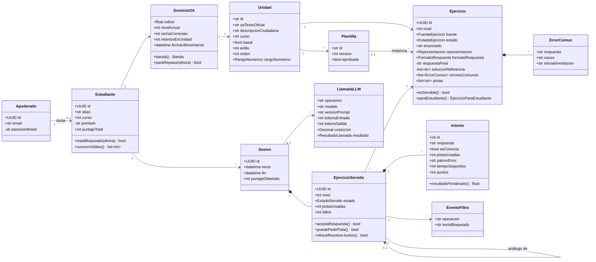

# Diagrama de Clases (Fase III, tarea 38)

**Proyecto:** Tutor inteligente basado en IA para el aprendizaje de matemáticas — eje de Números, 4°–6° básico.
**Documento:** Diagrama de clases del backend en dos vistas: (1) las entidades del dominio, que corresponden 1:1 a las tablas de `modelo_base_datos.md`, y (2) los servicios, que corresponden a los componentes de `arquitectura.md` §3. Corrige los bocetos del anteproyecto según `arquitectura.md` §7: el LLM no es una clase del dominio sino infraestructura detrás de `AdaptadorLLM`, la corrección es programática (`Corrector`) y existen `Intento` y `DominioOA`.

---

## 1. Entidades del dominio

Atributos resumidos; el detalle de tipos y restricciones está en `modelo_base_datos.md` §3. Los métodos listados son reglas del propio objeto, sin acceso a la base de datos.

**Enumeraciones:** `FuenteEjercicio` {parametrica, llm, gold} · `EstadoEjercicio` {borrador, verificado, activo, descartado, retirado} · `FormatoRespuesta` {numerico, fraccion, ordenar, comparar} · `EstadoServido` {en_curso, resuelto, abandonado, explicado} · `Banda` {Empezando, Practicando, Dominado} · `ResultadoLlamada` {ok, timeout, error, filtrado, degradado, tope}.

`respuestaFinal` y `solucionReferencia` son privados en el diagrama para marcar que **no salen del servidor**: `paraEstudiante()` devuelve la proyección `EjercicioParaEstudiante` (id, enunciado, representación, formato, nivel), que no tiene esos campos (RF-D3, AD-1).

## 2. Servicios

Cada servicio es una clase Python sin estado, con sus dependencias inyectadas por FastAPI (`Depends`), lo que permite reemplazar el proveedor LLM o la base de datos por dobles de prueba en pytest. Las flechas punteadas indican dependencias.

```mermaid
classDiagram
    direction TB

    class ServicioAuth {
        +registrarApoderado(email, password) Apoderado
        +loginApoderado(email, password) Token
        +loginEstudiante(estudianteId, pin) Token
        +crearEstudiante(apoderado, alias, curso, pin) Estudiante
        +cambiarCurso(apoderado, curso)
        +cambiarPin(apoderado, pin)
    }
    class CatalogoCurricular {
        +unidadesVisibles(estudiante) list~Unidad~
        +unidadSugerida(estudiante) Unidad
    }
    class BancoEjercicios {
        +servir(estudiante, unidad, nivel) Ejercicio
        +celdasConStockBajo() list~Celda~
        +analogo(ejercicio) Ejercicio
    }
    class Corrector {
        <<función pura>>
        +corregir(respuestaCruda, ejercicio) ResultadoCorreccion
        +normalizar(texto, formato) Valor
    }
    class MotorAdaptativo {
        +nivelPara(estudiante, unidad) int
        +registrarIntento(intento) CambioNivel
    }
    class OrquestadorPedagogico {
        +iniciarEjercicio(sesion, unidad) EjercicioServido
        +responder(servido, respuesta, tiempo) RespuestaTutor
        +pedirPista(servido) RespuestaTutor
        +noEntiendo(servido) RespuestaTutor
        +resolverJuntos(servido) ExplicacionGuiada
        +otroEjercicio(servido) EjercicioServido
    }
    class FiltroNoRevelacion {
        <<función pura>>
        +revela(texto, ejercicio) bool
    }
    class PlantillasLocales {
        +refuerzo(banda, logro) str
        +errorSinLLM(ejercicio, patron) str
        +aviso(evento) str
    }
    class Gamificacion {
        +puntosPor(intento, nivel) int
    }
    class ServicioDashboard {
        +resumenSemanal(estudiante) Resumen
        +medidores(estudiante) list~Medidor~
        +unidadesDificiles(estudiante) list~Unidad~
        +sugerencias(estudiante) list~str~
    }
    class GeneradorParametrico {
        +instanciar(plantilla, nivel) Ejercicio
    }
    class PipelineVerificacion {
        +verificarAritmetica(ejercicio, segundaPasada) bool
        +verificarForma(ejercicio, unidad) bool
        +triaje(ejercicio) Veredicto
    }
    class ReposicionBanco {
        <<job APScheduler>>
        +ejecutar()
    }
    class ServicioRevision {
        <<CLI>>
        +pendientes() list~Ejercicio~
        +aprobar(ejercicio, revisor)
        +descartar(ejercicio, revisor, motivo)
        +aprobarPlantilla(plantilla, revisor)
    }
    class AdaptadorLLM {
        +generarEjercicio(unidad, nivel, ejemploGold) Ejercicio
        +triajeEjercicio(ejercicio) Veredicto
        +generarRetroalimentacion(ctx) str
        +generarPista(ctx) str
        +narrarExplicacionGuiada(ctx) list~str~
        +disponible() bool
    }
    class ProveedorLLM {
        <<interface>>
        +completar(prompt, esquema, parametros) Respuesta
    }
    class ProveedorOpenAI
    class ContabilidadCosto {
        +registrar(llamada)
        +gastoDelMes() Decimal
        +bajoTope() bool
    }
    class CircuitBreaker {
        +permitir() bool
        +registrarFallo()
        +registrarExito()
    }
    class RepositorioPrompts {
        +render(nombre, variables) PromptVersionado
    }

    OrquestadorPedagogico ..> BancoEjercicios
    OrquestadorPedagogico ..> Corrector
    OrquestadorPedagogico ..> MotorAdaptativo
    OrquestadorPedagogico ..> Gamificacion
    OrquestadorPedagogico ..> AdaptadorLLM
    OrquestadorPedagogico ..> FiltroNoRevelacion
    OrquestadorPedagogico ..> PlantillasLocales
    CatalogoCurricular ..> MotorAdaptativo
    ServicioDashboard ..> MotorAdaptativo
    ReposicionBanco ..> BancoEjercicios
    ReposicionBanco ..> GeneradorParametrico
    ReposicionBanco ..> AdaptadorLLM
    ReposicionBanco ..> PipelineVerificacion
    PipelineVerificacion ..> Corrector
    PipelineVerificacion ..> AdaptadorLLM
    ServicioRevision ..> BancoEjercicios
    AdaptadorLLM ..> ProveedorLLM
    AdaptadorLLM ..> ContabilidadCosto
    AdaptadorLLM ..> CircuitBreaker
    AdaptadorLLM ..> RepositorioPrompts
    ProveedorOpenAI ..|> ProveedorLLM
```

## 3. Responsabilidades y decisiones

| Clase | Decisión | Requisitos |
|---|---|---|
| `Corrector`, `FiltroNoRevelacion` | Funciones puras que comparten el normalizador: el filtro detecta la respuesta en las mismas formas que el corrector acepta (coma o punto, fracciones equivalentes). Son las piezas con más pruebas unitarias. | AD-2, RNF-P1, RNF-P2 |
| `OrquestadorPedagogico` | Único que decide qué se le pide al LLM y único que conoce `EjercicioServido`. Toda salida del LLM hacia el estudiante pasa por `FiltroNoRevelacion`; si revela, se reemplaza por la pista almacenada y se registra un `EventoFiltro`. | RF-P1–P7 |
| `AdaptadorLLM` | Las firmas de sus métodos **solo aceptan contenido matemático** (el contexto `ctx` no tiene alias ni ids), así la minimización queda garantizada por la interfaz. Concentra timeout (8 s), reintentos, circuit breaker y el tope de costo. | AD-4, RNF-S3, RNF-C1, RNF-R3 |
| `ProveedorLLM` | Interfaz con una sola implementación en TT2 (`ProveedorOpenAI`). Cambiar a Gemini Flash-Lite es agregar otra implementación y cambiar la configuración. | RNF-M3 |
| `RepositorioPrompts` | Lee las plantillas Jinja2/YAML de `/prompts`; cada prompt renderizado lleva su versión, que se guarda en `LlamadaLLM.versionPrompt` y `Ejercicio.versionPrompt`. | RNF-M1 |
| `MotorAdaptativo` | Aplica el promedio móvil exponencial y las reglas de nivel. Los parámetros (α, umbrales, racha, descuento por pista, días de repaso) se leen de configuración. | RF-E2–E4, AD-5 |
| `ServicioDashboard` | Solo consultas de agregación; no depende de `AdaptadorLLM`. | AD-6, RF-DA |
| `ReposicionBanco` | Job del planificador; se ejecuta en un único proceso (ver `diagrama_despliegue.md` §3). | AD-3, AD-9 |
