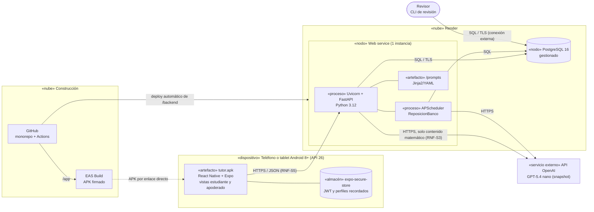

# Diagrama de Despliegue (Fase III, tarea 40)

**Proyecto:** Tutor inteligente basado en IA para el aprendizaje de matemáticas — eje de Números, 4°–6° básico.
**Documento:** Nodos físicos y de ejecución del sistema y cómo llega cada artefacto a su nodo. Refleja la decisión del 24-sep-2026 (app nativa Android + API en Render + PostgreSQL gestionado + OpenAI) de `stack_tecnologico.md` y `arquitectura.md` (AD-8).

---

## 1. Diagrama

## 2. Nodos y artefactos

| Nodo | Qué ejecuta o guarda | Configuración y secretos |
|---|---|---|
| Dispositivo Android | App compilada (`minSdkVersion` 26), teléfono y tablet, vertical y horizontal. Guarda solo el JWT y la lista de perfiles del dispositivo (id + alias). Sin solución de referencia ni lógica de corrección (AD-1). | URL de la API compilada en la app (`EXPO_PUBLIC_API_URL`); no contiene secretos. |
| Render — web service | API FastAPI y el job de reposición en el **mismo proceso**. Lee `/prompts` del propio repositorio desplegado. | Variables de entorno de Render: `DATABASE_URL`, `OPENAI_API_KEY`, `JWT_SECRET`, `LLM_MODELO` (snapshot), `LLM_TOPE_USD=5`. |
| Render — PostgreSQL | Todas las tablas de `modelo_base_datos.md`. | Credenciales generadas por Render. |
| API OpenAI | Recibe solo contenido matemático, sin alias ni ids (`estrategia_llm.md` §4). | API key solo en el servidor (RNF-S5). |
| GitHub | Monorepo `/app`, `/backend`, `/prompts`, `/docs`. Actions corre pytest cuando cambia `/backend` y lint + Jest cuando cambia `/app`. | *Secrets* de GitHub Actions si alguna prueba de integración los necesita. |
| EAS Build | Compila el APK firmado desde `/app`. | Keystore de firma en EAS y respaldado **fuera** del repositorio (`*.jks`, `*.keystore` en `.gitignore`). |

## 3. Restricciones de ejecución

| Restricción | Consecuencia | Decisión |
|---|---|---|
| APScheduler corre dentro del proceso web. | Con más de un worker o instancia, el job correría duplicado y generaría ejercicios de más. | Uvicorn con **un solo worker** (suficiente para ~30 concurrentes, RNF-R4), y el job toma un `pg_try_advisory_lock` antes de ejecutar como protección si alguna vez se escala. |
| La instancia gratuita de Render **se duerme** tras ~15 min sin tráfico. | Mientras duerme, el planificador no corre; el primer request después tarda varios segundos. | Desarrollo: aceptable. Además, al servir un ejercicio (F1) se revisa el stock de esa celda y, si baja de 5, se agenda una reposición inmediata en segundo plano. Mes de validación: plan básico (~US$7), que no se duerme (`stack_tecnologico.md` §4). |
| El revisor necesita acceder a la base de datos. | La CLI de revisión (`casos_de_uso.md` §4) se ejecuta en el PC del revisor. | Se conecta con la URL externa de PostgreSQL de Render, que exige TLS. La URL se guarda en el `.env` local del revisor, que no se sube al repositorio. |
| Los evaluadores de la Fase V instalan un APK. | Hace falta permitir "instalar apps de origen desconocido" (riesgo R16). | Instrucciones de instalación en el manual de usuario (tarea 86); la prueba interna de Google Play queda como opción. |

## 4. Entornos

| Entorno | App | API | Base de datos | LLM |
|---|---|---|---|---|
| Desarrollo | Expo Go o emulador de Android Studio | Uvicorn local | PostgreSQL local (Docker) | OpenAI con la key personal, o un proveedor simulado en pruebas |
| Pruebas automáticas (CI) | Jest | pytest | PostgreSQL de servicio en GitHub Actions | proveedor simulado (`ProveedorLLM` de prueba): la CI nunca gasta tokens |
| Validación (Fase V) | APK de EAS | Render, plan básico | Render PostgreSQL | OpenAI con el snapshot congelado |
