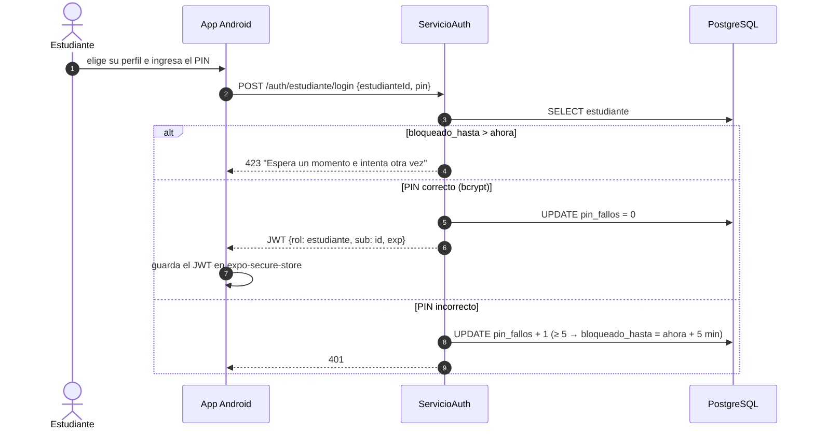
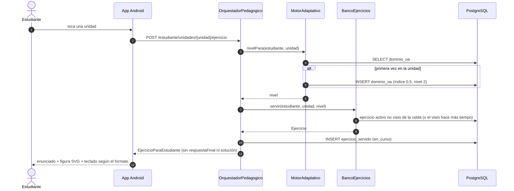
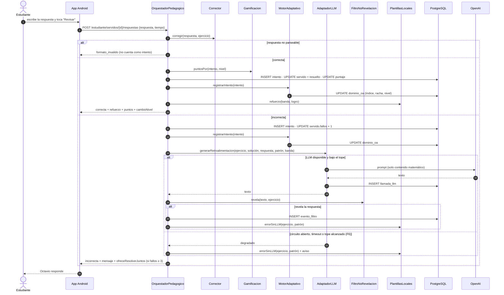
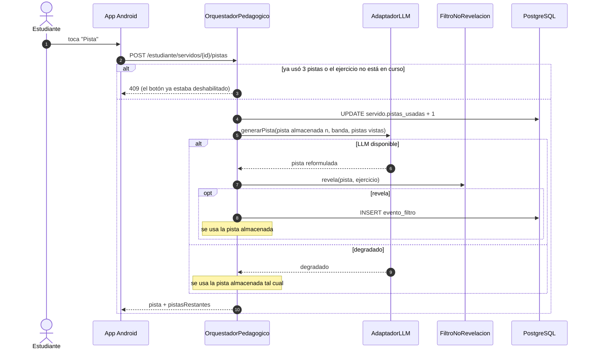
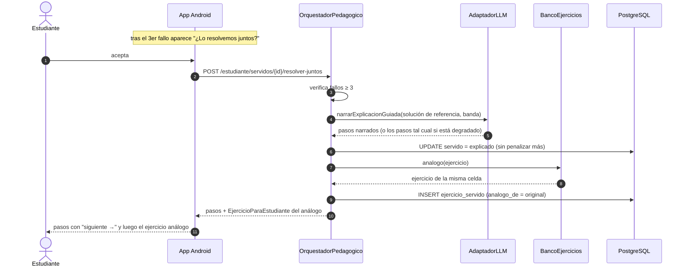
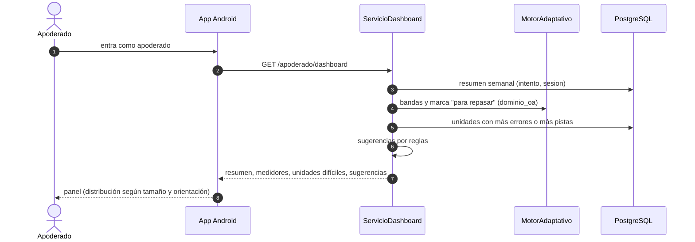
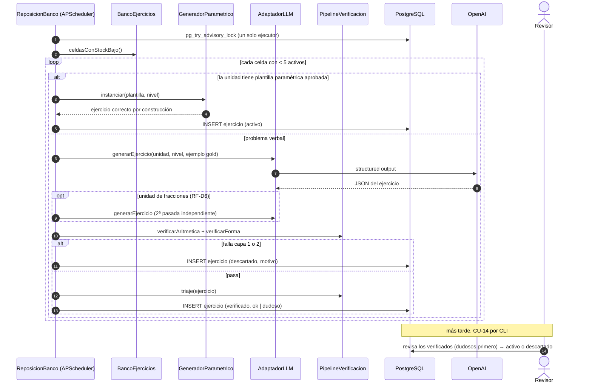

# Diagramas de Secuencia (Fase III, tarea 39)

**Proyecto:** Tutor inteligente basado en IA para el aprendizaje de matemáticas — eje de Números, 4°–6° básico.
**Documento:** Diagramas de secuencia de los flujos F1–F6 de `arquitectura.md` §5, más el acceso del estudiante y la explicación guiada. Usan las clases de `diagrama_clases.md` y las tablas de `modelo_base_datos.md`. En §1 se fija el contrato preliminar de la API que usan los diagramas, para que la app y el backend puedan avanzar en paralelo en la Fase IV.

---

## 1. Contrato preliminar de la API

Todas las rutas van sobre HTTPS con el JWT en la cabecera `Authorization` (salvo el registro y los dos login). El rol del token restringe las rutas: `/estudiante/*` exige rol `estudiante` y `/apoderado/*` exige rol `apoderado`.

| Método y ruta | Rol | Flujo | Respuesta (resumen) |
|---|---|---|---|
| `POST /auth/apoderado/registro` | — | CU-9 | apoderado creado |
| `POST /auth/apoderado/login` | — | CU-1 | JWT de apoderado |
| `POST /auth/estudiante/login` | — | CU-1 (§2) | JWT de estudiante |
| `POST /apoderado/estudiante` · `PATCH /apoderado/estudiante` | apoderado | CU-9 | perfil (alias, curso); fija o cambia el PIN |
| `GET /apoderado/dashboard` | apoderado | F4 | resumen semanal, medidores, unidades difíciles, sugerencias |
| `GET /estudiante/unidades` | estudiante | CU-2 | unidades visibles con estrellas + unidad sugerida |
| `POST /estudiante/sesiones` · `POST /estudiante/sesiones/{id}/cierre` | estudiante | — | abre y cierra la sesión |
| `POST /estudiante/unidades/{unidad}/ejercicio` | estudiante | F1 | `EjercicioParaEstudiante` + id del ejercicio servido |
| `POST /estudiante/servidos/{id}/respuestas` | estudiante | F2 | `RespuestaTutor` |
| `POST /estudiante/servidos/{id}/pistas` | estudiante | F3 | `RespuestaTutor` |
| `POST /estudiante/servidos/{id}/no-entiendo` | estudiante | F2 | `RespuestaTutor` |
| `POST /estudiante/servidos/{id}/resolver-juntos` | estudiante | RF-P7 | pasos narrados + id del ejercicio análogo |
| `GET /estudiante/progreso` | estudiante | CU-6 | puntos, estrellas e insignias |

`RespuestaTutor` = `{ resultado: correcta | incorrecta | formato_invalido, mensaje, puntos, pistasRestantes, ofreceResolverJuntos, cambioNivel, degradado }`. Nunca contiene la respuesta final ni la solución de referencia.

## 2. Acceso del estudiante (CU-1)

El dispositivo recuerda los perfiles que entraron antes en él (solo id y alias, en `expo-secure-store`), así el niño elige su perfil sin escribir un correo.

## 3. F1 — Servir ejercicio (sin LLM)

## 4. F2 — Responder: correcta e incorrecta (incluye F6)

La ruta de respuesta correcta no llama al LLM (`modelo_pedagogico.md` §3). El alias se inserta en el servidor después del filtro, en el marcador `{nombre}` (`estrategia_llm.md` §4).

## 5. F3 — Pedir pista

El descuento de la pista se aplica al responder: `intento.pistas_usadas` copia el contador del ejercicio servido y lo usan `Gamificacion` y `MotorAdaptativo` (`modelo_estudiante.md` §1).

## 6. Resolver juntos (RF-P7)

Durante la narración el filtro deja pasar los pasos intermedios del ejercicio original, pero sigue bloqueando la respuesta del análogo (`modelo_pedagogico.md` §6).

## 7. F4 — Dashboard del apoderado (sin LLM)

## 8. F5 — Reposición del banco (asíncrono)

Si el Adaptador está degradado o sin presupuesto, el lote verbal se pospone al siguiente ciclo y el banco sigue sirviendo lo que tiene (`estrategia_llm.md` §3).
