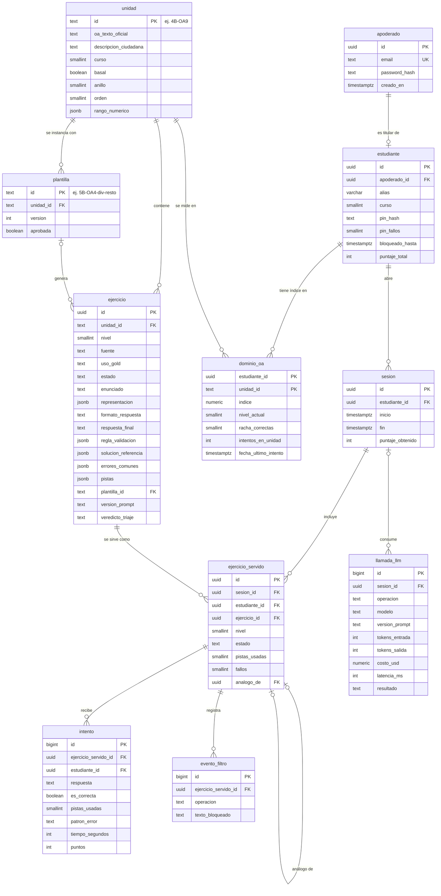

# Modelo Detallado de la Base de Datos (Fase III, tarea 41)

**Proyecto:** Tutor inteligente basado en IA para el aprendizaje de matemáticas — eje de Números, 4°–6° básico.
**Documento:** Modelo entidad-relación y DDL de PostgreSQL 16. Precisa las entidades de `arquitectura.md` §4 con los campos que exigen `modelo_dominio.md` (§1 catálogo, §2 esquema del ejercicio, §7 gold standard, §8 pipeline), `modelo_estudiante.md` (§1 señales, §8 `DominioOA`), `modelo_pedagogico.md` (§5 política de intentos, §6 filtro) y `estrategia_llm.md` (§5 registro por llamada). El DDL es la referencia para las migraciones de Alembic de la Fase IV (tarea 48).

---

## 1. Cambios respecto de `arquitectura.md` §4

| Cambio | Motivo |
|---|---|
| `Usuario` pasa a llamarse **`apoderado`**. | Es el único usuario con credenciales. El estudiante entra por perfil + PIN y no tiene correo; el revisor usa la CLI (`casos_de_uso.md` §4). |
| El PIN se guarda como **`pin_hash`** (bcrypt), con contador de fallos y bloqueo temporal. | Un PIN de 4 dígitos tiene 10 000 combinaciones: sin bloqueo se prueba entero en minutos (RNF-S1). |
| Nueva entidad **`ejercicio_servido`** entre `sesion` e `intento`. | Un ejercicio servido admite varias respuestas (RF-P7 cuenta 3 fallos **del mismo ejercicio**), pistas pedidas antes de responder y el cierre por "otro ejercicio". Sin esta entidad, el contador de pistas y fallos quedaría en el cliente, y el servidor debe ser la autoridad (AD-1). También resuelve "no visto" en F1. |
| **`intento`** = una respuesta corregida (válida). | Coincide con `modelo_estudiante.md` §1: cada respuesta evaluada produce un intento; las rechazadas por formato no se guardan. |
| Nueva tabla **`plantilla`**. | Registra la aprobación única de cada plantilla paramétrica (`modelo_dominio.md` §8) y da destino a `metadatos.plantillaId`. |
| Nuevas tablas **`llamada_llm`** y **`evento_filtro`**. | Contabilidad de tokens y tope mensual (RNF-C1, `estrategia_llm.md` §5) y métrica de revelaciones bloqueadas para la validación de TT2 (`modelo_pedagogico.md` §6). |
| Los campos del pipeline (`veredicto_triaje`, `revisado_por`, `motivo_descarte`) viven en `ejercicio`. | Un ejercicio pasa una sola vez por el pipeline; una tabla aparte no aporta. |

**Se derivan por consulta y no se almacenan** (una sola fuente de verdad): banda del índice y estrellas, marca `paraRepasar`, unidad sugerida, insignias, racha semanal y todos los indicadores del dashboard.

## 2. Diagrama entidad-relación



## 3. DDL (PostgreSQL 16)

Los valores enumerados se implementan como `text` + `CHECK` y no como tipos `ENUM` de PostgreSQL: agregar un valor es una migración de una línea y Alembic no tiene que recrear el tipo.

```sql
CREATE EXTENSION IF NOT EXISTS citext;

-- Cuentas ------------------------------------------------------------------

CREATE TABLE apoderado (
    id             uuid PRIMARY KEY DEFAULT gen_random_uuid(),
    email          citext NOT NULL UNIQUE,
    password_hash  text   NOT NULL,                -- bcrypt (RNF-S1)
    creado_en      timestamptz NOT NULL DEFAULT now()
);

CREATE TABLE estudiante (
    id               uuid PRIMARY KEY DEFAULT gen_random_uuid(),
    apoderado_id     uuid NOT NULL UNIQUE           -- UNIQUE = 1 apoderado ↔ 1 estudiante (RF-A1, por ratificar)
                     REFERENCES apoderado(id) ON DELETE CASCADE,
    alias            varchar(30) NOT NULL,          -- sin datos identificatorios (RF-A5, RNF-S2)
    curso            smallint NOT NULL CHECK (curso BETWEEN 4 AND 6),
    pin_hash         text NOT NULL,
    pin_fallos       smallint NOT NULL DEFAULT 0,
    bloqueado_hasta  timestamptz,
    puntaje_total    integer NOT NULL DEFAULT 0 CHECK (puntaje_total >= 0),
    creado_en        timestamptz NOT NULL DEFAULT now()
);

-- Catálogo curricular (datos, sin lógica: RNF-M2) ----------------------------

CREATE TABLE unidad (
    id                     text PRIMARY KEY,        -- oaCodigo, ej. '4B-OA9'
    oa_texto_oficial       text NOT NULL,
    descripcion_ciudadana  text NOT NULL,
    curso                  smallint NOT NULL CHECK (curso BETWEEN 4 AND 6),
    basal                  boolean NOT NULL,
    anillo                 smallint NOT NULL CHECK (anillo IN (1, 2)),
    orden                  smallint NOT NULL,
    rango_numerico         jsonb NOT NULL,
    activa                 boolean NOT NULL DEFAULT true,
    UNIQUE (curso, orden)
);

CREATE TABLE plantilla (
    id            text PRIMARY KEY,                 -- ej. '5B-OA4-div-resto'
    unidad_id     text NOT NULL REFERENCES unidad(id),
    version       integer NOT NULL DEFAULT 1,
    aprobada      boolean NOT NULL DEFAULT false,
    aprobada_por  text,
    aprobada_en   timestamptz
);

-- Banco de ejercicios ------------------------------------------------------------

CREATE TABLE ejercicio (
    id                   uuid PRIMARY KEY DEFAULT gen_random_uuid(),
    unidad_id            text NOT NULL REFERENCES unidad(id),
    nivel                smallint NOT NULL CHECK (nivel BETWEEN 1 AND 3),
    fuente               text NOT NULL CHECK (fuente IN ('parametrica', 'llm', 'gold')),
    uso_gold             text CHECK (uso_gold IN ('fewshot', 'validacion')),
    estado               text NOT NULL DEFAULT 'borrador'
                         CHECK (estado IN ('borrador', 'verificado', 'activo', 'descartado', 'retirado')),
    enunciado            text NOT NULL,
    representacion       jsonb,                     -- {tipo, parametros}; el cliente dibuja el SVG
    formato_respuesta    text NOT NULL CHECK (formato_respuesta IN ('numerico', 'fraccion', 'ordenar', 'comparar')),
    respuesta_final      text NOT NULL,             -- nunca viaja al cliente (RF-D3, AD-1)
    regla_validacion     jsonb NOT NULL DEFAULT '{}',
    solucion_referencia  jsonb NOT NULL,            -- arreglo de pasos; nunca viaja al cliente
    errores_comunes      jsonb NOT NULL DEFAULT '[]',
    pistas               jsonb NOT NULL DEFAULT '[]',
                                                    -- 3 pistas en todo ejercicio servible; los gold no las necesitan
    plantilla_id         text REFERENCES plantilla(id),
    lote_generacion      text,
    version_prompt       text,
    veredicto_triaje     text CHECK (veredicto_triaje IN ('ok', 'dudoso')),
    motivo_descarte      text,
    revisado_por         text,
    revisado_en          timestamptz,
    creado_en            timestamptz NOT NULL DEFAULT now(),
    CHECK ((fuente = 'gold') = (uso_gold IS NOT NULL)),
    CHECK (fuente = 'gold' OR jsonb_array_length(pistas) = 3),
    CHECK (fuente <> 'parametrica' OR plantilla_id IS NOT NULL)
);

-- F1: ejercicios servibles de una celda unidad×nivel (los gold nunca rotan)
CREATE INDEX ix_ejercicio_celda_activa ON ejercicio (unidad_id, nivel)
    WHERE estado = 'activo' AND fuente <> 'gold';
-- Cola de la revisión humana: dudosos y sin triaje primero (false < true)
CREATE INDEX ix_ejercicio_revision ON ejercicio ((veredicto_triaje IS NOT DISTINCT FROM 'ok'), creado_en)
    WHERE estado = 'verificado';

-- Uso y desempeño ----------------------------------------------------------------

CREATE TABLE sesion (
    id                uuid PRIMARY KEY DEFAULT gen_random_uuid(),
    estudiante_id     uuid NOT NULL REFERENCES estudiante(id) ON DELETE CASCADE,
    inicio            timestamptz NOT NULL DEFAULT now(),
    fin               timestamptz,
    puntaje_obtenido  integer NOT NULL DEFAULT 0
);
CREATE INDEX ix_sesion_estudiante ON sesion (estudiante_id, inicio);

CREATE TABLE ejercicio_servido (
    id             uuid PRIMARY KEY DEFAULT gen_random_uuid(),
    sesion_id      uuid NOT NULL REFERENCES sesion(id) ON DELETE CASCADE,
    estudiante_id  uuid NOT NULL REFERENCES estudiante(id) ON DELETE CASCADE,
    ejercicio_id   uuid NOT NULL REFERENCES ejercicio(id),
    nivel          smallint NOT NULL CHECK (nivel BETWEEN 1 AND 3),   -- nivel con que se sirvió
    estado         text NOT NULL DEFAULT 'en_curso'
                   CHECK (estado IN ('en_curso', 'resuelto', 'abandonado', 'explicado')),
    pistas_usadas  smallint NOT NULL DEFAULT 0 CHECK (pistas_usadas BETWEEN 0 AND 3),
    fallos         smallint NOT NULL DEFAULT 0,
    analogo_de     uuid REFERENCES ejercicio_servido(id),              -- RF-P7
    servido_en     timestamptz NOT NULL DEFAULT now(),
    terminado_en   timestamptz
);
-- "no visto" en F1 y re-servir el más antiguo cuando la celda se agota
CREATE INDEX ix_servido_estudiante_ejercicio ON ejercicio_servido (estudiante_id, ejercicio_id, servido_en);

CREATE TABLE intento (
    id                    bigint GENERATED ALWAYS AS IDENTITY PRIMARY KEY,
    ejercicio_servido_id  uuid NOT NULL REFERENCES ejercicio_servido(id) ON DELETE CASCADE,
    estudiante_id         uuid NOT NULL REFERENCES estudiante(id) ON DELETE CASCADE,  -- desnormalizado para el dashboard
    respuesta             text NOT NULL,
    es_correcta           boolean NOT NULL,
    pistas_usadas         smallint NOT NULL CHECK (pistas_usadas BETWEEN 0 AND 3),
    patron_error          text,                    -- causa del error común detectado, si hubo
    tiempo_segundos       integer NOT NULL CHECK (tiempo_segundos >= 0),
    puntos                integer NOT NULL DEFAULT 0,
    creado_en             timestamptz NOT NULL DEFAULT now()
);
CREATE INDEX ix_intento_estudiante_fecha ON intento (estudiante_id, creado_en);

CREATE TABLE dominio_oa (
    estudiante_id         uuid NOT NULL REFERENCES estudiante(id) ON DELETE CASCADE,
    unidad_id             text NOT NULL REFERENCES unidad(id),
    indice                numeric(4,3) NOT NULL DEFAULT 0.5 CHECK (indice BETWEEN 0 AND 1),
    nivel_actual          smallint NOT NULL DEFAULT 2 CHECK (nivel_actual BETWEEN 1 AND 3),
    racha_correctas       smallint NOT NULL DEFAULT 0,
    intentos_en_unidad    integer NOT NULL DEFAULT 0,
    fecha_ultimo_intento  timestamptz,
    PRIMARY KEY (estudiante_id, unidad_id)
);

-- Operación del LLM --------------------------------------------------------------

CREATE TABLE llamada_llm (
    id              bigint GENERATED ALWAYS AS IDENTITY PRIMARY KEY,
    sesion_id       uuid REFERENCES sesion(id) ON DELETE SET NULL,   -- NULL en generación y triaje
    operacion       text NOT NULL CHECK (operacion IN ('generarEjercicio', 'triajeEjercicio',
                    'generarRetroalimentacion', 'generarPista', 'narrarExplicacionGuiada')),
    modelo          text NOT NULL,                  -- snapshot exacto
    version_prompt  text NOT NULL,
    tokens_entrada  integer NOT NULL DEFAULT 0,
    tokens_salida   integer NOT NULL DEFAULT 0,
    costo_usd       numeric(10,6) NOT NULL DEFAULT 0,
    latencia_ms     integer,
    resultado       text NOT NULL CHECK (resultado IN ('ok', 'timeout', 'error', 'filtrado', 'degradado', 'tope')),
    creado_en       timestamptz NOT NULL DEFAULT now()
);
-- Costo del mes en curso (alerta 80 %, corte 100 %)
CREATE INDEX ix_llamada_fecha ON llamada_llm (creado_en);

CREATE TABLE evento_filtro (
    id                    bigint GENERATED ALWAYS AS IDENTITY PRIMARY KEY,
    ejercicio_servido_id  uuid REFERENCES ejercicio_servido(id) ON DELETE SET NULL,
    operacion             text NOT NULL,
    texto_bloqueado       text NOT NULL,           -- datos sintéticos en TT1/TT2 (RNF-S4)
    creado_en             timestamptz NOT NULL DEFAULT now()
);
```

## 4. Consultas derivadas (referencia)

**Stock de una celda** (F5, umbral de reposición < 5):

```sql
SELECT u.id, n.nivel, count(e.id) AS activos
FROM unidad u
CROSS JOIN generate_series(1, 3) AS n(nivel)
LEFT JOIN ejercicio e ON e.unidad_id = u.id AND e.nivel = n.nivel
                     AND e.estado = 'activo' AND e.fuente <> 'gold'
WHERE u.activa
GROUP BY u.id, n.nivel
HAVING count(e.id) < 5;
```

**Servir un ejercicio no visto** (F1). Si no queda ninguno, se re-sirve el visto hace más tiempo (`modelo_estudiante.md` §7):

```sql
SELECT e.id
FROM ejercicio e
LEFT JOIN LATERAL (
    SELECT max(s.servido_en) AS ultimo
    FROM ejercicio_servido s
    WHERE s.estudiante_id = :estudiante AND s.ejercicio_id = e.id
) v ON true
WHERE e.unidad_id = :unidad AND e.nivel = :nivel
  AND e.estado = 'activo' AND e.fuente <> 'gold'
ORDER BY v.ultimo NULLS FIRST, random()
LIMIT 1;
```

**Resumen semanal del dashboard** (RF-DA1):

```sql
SELECT count(*)                                  AS ejercicios_respondidos,
       avg(es_correcta::int)                     AS tasa_aciertos,
       count(DISTINCT date(creado_en))           AS dias_con_practica
FROM intento
WHERE estudiante_id = :estudiante
  AND creado_en >= date_trunc('week', now());
```

**Banda y marca "para repasar"** (`modelo_estudiante.md` §5–6):

```sql
SELECT unidad_id,
       CASE WHEN indice < 0.4 THEN 'Empezando'
            WHEN indice < 0.8 THEN 'Practicando'
            ELSE 'Dominado' END                  AS banda,
       (indice >= 0.4 AND fecha_ultimo_intento < now() - interval '21 days') AS para_repasar
FROM dominio_oa
WHERE estudiante_id = :estudiante;
```

## 5. Reglas de integridad que no expresa el DDL

Las garantiza la capa de servicios y se prueban en la tarea 52:

- `respuesta_final` y `solucion_referencia` nunca se serializan hacia la app. El esquema Pydantic de salida (`EjercicioParaEstudiante`) simplemente no tiene esos campos.
- Un `ejercicio_servido` en estado distinto de `en_curso` no acepta respuestas ni pistas.
- Un ejercicio `llm` solo pasa a `activo` con `revisado_por` informado. Un ejercicio `parametrica` solo se crea si su plantilla está `aprobada`.
- La alerta del 80 % y el corte del 100 % del tope mensual se calculan sumando `llamada_llm.costo_usd` del mes.

## 6. Puntos abiertos

- **Marca "para repasar":** `modelo_estudiante.md` §5 dice que se limpia tras ≥ 3 intentos nuevos, pero §8 dice que se deriva por consulta, y la consulta la limpia con el primer intento. Se adopta la derivación (sin columna extra); si el equipo prefiere exigir 3 intentos, basta con un contador `intentos_desde_repaso` en `dominio_oa`.
- **Un apoderado ↔ un estudiante** (RF-A1) está pendiente de ratificar. Si se permiten varios estudiantes, basta con quitar `UNIQUE` de `estudiante.apoderado_id`.
- **Retención de `evento_filtro.texto_bloqueado`:** es útil para analizar los fallos de la prueba adversarial. Si en el futuro se opera con usuarios reales, conviene fijar un plazo de borrado.
